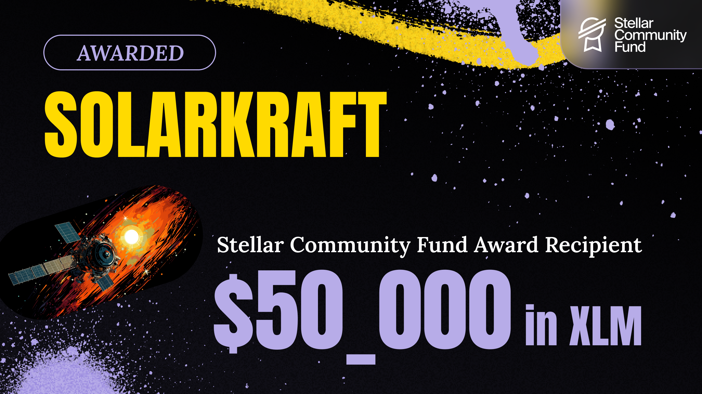

# Solarkraft

Solarkraft is a runtime monitoring tool for [Soroban][], powered by [TLA+][]
and [Apalache][].

The project is in the boostrapping phase now. Preparing for Warp 5.

We are grateful to the [Stellar Community Fund][] for supporting our project via
the Activation Award. Check our [3-minute pitch][].  If it has caught your
attention, read the [SCF24 Application][].

.

[Soroban]: https://soroban.stellar.org/docs
[TLA+]: https://lamport.azurewebsites.net/tla/tla.html
[Apalache]: https://github.com/informalsystems/apalache
[Stellar Community Fund]: https://communityfund.stellar.org/
[SCF24 Application]: https://dashboard.communityfund.stellar.org/scfawards/scf-24/informationcollection/suggestion/734
[3-minute pitch]: https://www.youtube.com/watch?v=Ogdy4AHfMRA