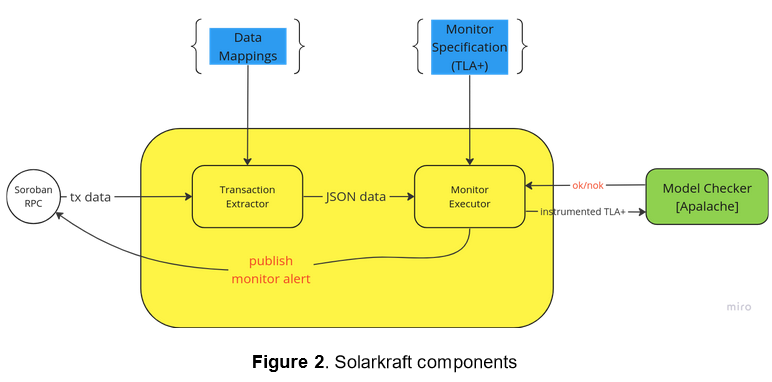

# ADR-001: Initial Data Structures and Interfaces

| authors                                | last revised    |
| -------------------------------------- | --------------: |
| Jure Kukovec                           | 2024-04-02      |

**Table of Contents**

- [Summary (Overview)](#summary)
- [Context (Problem)](#context)
- [Options (Alternatives)](#options)
- [Solution (Decision)](#solution)
- [Consequences (Retrospection)](#consequences)

## Summary

<!-- Statement to summarize, following the following formula: -->

The Solarkraft proposal outlines a rough data-flow diagram of the intended architecture. 
In practice, it is important to design the underlying data structures and interfaces
in a maintainable, extensible, and generally future-proof way, as to minimize the need for significant refactoring due to tech debt in the future.

## Context

This diagram shows the initial design of the Solarkraft architecture: 

 

To create this initial architecture, three core components are necessary:

	1. A data representation of a smart contract
	2. A Transition Executor
	3. A Monitor Executor

We describe each component, and their interactions with the other two, separately below.
	
### Smart contracts
Smart contracts are the base objects, which are stored, modified, or inspected by various Solarkraft components.

While smart contracts in e.g. Soroban feature fully executable code, for the purposes of runtime monitoring we do not have to capture their functionality whatsoever. 
Thus, for our purposes, smart contracts consist of 

	1. Smart contract State, and
	2. Smart contract Interface

Here, _State_ is an unordered collection of _named fields_, each of which holds a value of [some type](types). Note that we are working with a significantly simplified set of types in practice;
The types we actually have to deal with boil down to primitives, arrays (Vectors), and mappings.

Thus, _State_ is inherently JSON-like.

In contrast, _Interface_ is simply an unordered collection of the public methods admitted by a contract, and can be thought of a simple set or array.

It is important to emphasize, that we do not need to capture function behavior in any way; the Transition Executor observes a history of transactions that have already happened, and the effects of functions are observed as changes to the state of a contract, from one block to another.

### Transition Extractor

This component reads transaction data from the Soroban RPC, and builds a transaction log; an ordered sequence of smart contract States (or tuples of States, if we're observing a collection of contracts), annotated with the names of the functions called at each step.

From a technical perspective, a key feature of the Transition Extractor, is dealing with the way the Soroban RPC serves data - the XDR format.

There are several [RPC methods](RPC) avaliable, though two are of particular interest to us:

	- `getLedgerEntries`, which allows us to probe any contract state, provided we can interpret the result XDR
	- `getTransaction`, which allows us to determine which functions were called. 
	
Using `getLedgerEntries`, we should be able to construct a smart contract _State_ (as defined above) object, and avoid XDR in other components of Solarkraft. [This guide](RPCguide) should be used to get a general idea of the steps required here.

#### Interface
We envision the following methods, as part of the Transition Executor interface:

```
fn readState(contractId: ContractId) -> State
```

### Monitor Executor

The role of this component is to interact with Apalache. 
We want to avoid implementing any form of TLA+ parsing in Solarkraft, so this component needs to solve the following problem:
Given a TLA+ monitor specification, which references internal named TLA+ state variables, the Monitor Executor needs to be able to translate our smart contract State format to a series of constraints over the monitor variables.

We can then perform the following steps:

	1. Monitor Executor receives a sequence of States from Transition Executor
	2. Using that sequence, Monitor Executor generates a TLA+ spec, which `EXTENDS` (but doesn't read) the monitor specification. This extension contains the constraints derived from the input States.
	3. Monitor Executor submits the new spec to the Apalache server for checking, receives ok/nok

In the case of a property violation, it would be best to delegate the alarm responsibilities to a different component, as not to overload Monitor Executor.

#### Interface
We envision the following methods, as part of the Monitor Executor interface:

```
fn stateToTLA(state: State, monitorContractName: str) -> TlaRepr

fn submitToApa(tla: TlaRepr, params:*) -> TlaRepr
```
	
## Options

<!-- Communicate the options considered.
     This records evidence of our circumspection and documents the various alternatives
     considered but not adopted.
-->

### Smart contracts
	1. Use JSON directly. Since State is very JSON-like, we can literally encode it as such
	2. Homebrew an internal representation format

### Transition Extractor
It is unclear that there are alternate ways to go about implementing this component, as it is effectively an XDR -> State parser.

### Monitor Executor
	1. Resolving names:
		1. Require monitor names to match the names of the variables in smart contracts (and thus State) exactly
		2. Implement a _name binding_ standard, for example a simple CSV file, which tells the executor which State fields correspond to which TLA+ state variables
	2. Building TLA+:
		1. Creating `.tla`-format files (such as those output as intermediate values by Apalache)
		2. Creating `.json`-format TLA+ input (Apalache specific)

## Solution
Regarding Smart contracts, I propose using JSON directly (1.), as it seems unlikely that we'd want to implement significantly broader capabilities for smart contracts in Solarkraft.

Regarding the Monitor Executor, I propose implementing direct name matching initially (1.1.), as it should be easy enough to implement (1.2.) in the future, should we have a need for it.
In addition, I strongly propose using Apalache's JSON input capabilities (2.2.), especially if we choose to implement States as JSON themselves.

## Consequences

<!-- Records the results of the decision over the long term.
     Did it work, not work, was changed, upgraded, etc.
-->

TBD

 
[types]: https://developers.stellar.org/docs/learn/smart-contract-internals/types/custom-types
[RPC]: https://developers.stellar.org/network/soroban-rpc/methods
[RPCguide]: https://developers.stellar.org/docs/smart-contracts/guides/rpc
[gLE]: https://developers.stellar.org/docs/smart-contracts/guides/rpc/retrieve-contract-code-python