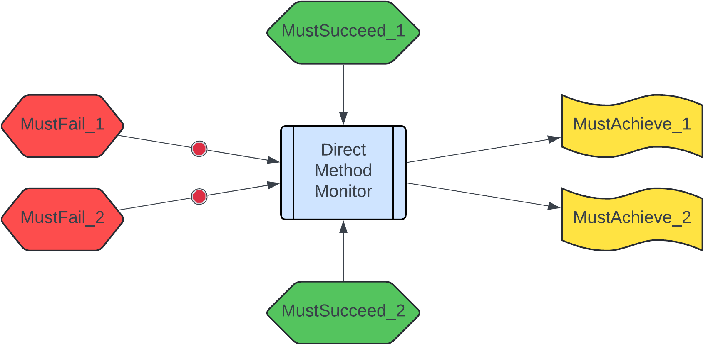
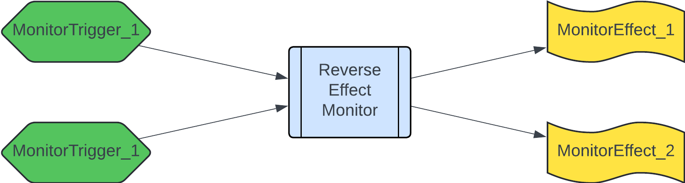

# Alternative monitor for Timelock using reverse reasoning

_Andrey Kuprianov, 2024_

------

In this example we are looking at the [Timelock contract][], the same that was used for the [SCF 24 submission example][]. Compared to _direct_ reasoning applied in the submission example (stucturing of specification according to methods: if a method is executed, then those should be its effects), we are going to apply an alternative structure, which we may call _hybrid_, where we combine direct specifications for methods with _reverse_ reasoning (start with the observed effects, and go back to the causes).


## Structuring monitor specifications

Before diving into the concrete timelock example, let's explore a bit of a theory of what we want to achieve with runtime monitors. Eventually, runtime monitors are going to be deployed on the live blockchain, and they should serve two purposes:

- **Prevent safety violations**: bad things, such as your token balance being stolen, should not happen. This is the primary goal of runtime monitors: react preventively, and abort unwanted executions.
- **Detect liveness violations**: good things should be able to happen! E.g. you, as an account owner, should be able to withdraw your own balance. If a legitimate transaction keeps reverting, that's also a bug, not less severe than someone stealing your tokens.
- **Detect unexpected behaviors**: same as code, specs are not perfect. If a spec author overlooked some behaviors, and they manifest themselves on the live blockchain, this may mean anything: from simple spec incompleteness, to an exploit being executed. Monitors can be configured to either issue a simple warning, or to prevent such behaviors altogether.

The problem we've observed with the specification approaches previously is that the specs of _what_ the method should do can easily be much larger than the actual implementation; compare e.g. this [ERC-721 Certora spec][] with the [ERC-721 implementation][] (don't forget to exclude comments when comparing).

So monitors should be able to specify both safety and liveness properties, and do it _compactly_. For that we impose a certain structure to the direct reasoning (cause -> effect), as well as apply the reverse reasoning (effect -> cause).

### Direct monitor specs

Here we reason from the cause (method invocation) to the effect, but apply a structure which closely mimics in formal semantics what we expect to see when we program smart contracts. The essence of the structure is in the picture below:



- `MustFail_i` is a condition under which the method is expected to fail. If _any_ of those conditions hold, the monitor fires, and checks that the method does indeed fail;
- `MustSucceed_i` is a condition, under which the method is expected to succeed, _provided that_ none of the `MustFail_i` conditions fired. Each `MustSucceed_i` condition represents a separate happy path in the method invocation;
- `MustAchieve_i` is a condition over past and next state variables, which specifies the effect that the method invocation should achieve (e.g. the tokens should be transferred). _All_ of `MustAchieve_i` should hold if the method is executed successfully.


In the above, `Must<Fail|Succeed|Achieve>` is a prefix, which tells the monitor system how to interpret this predicate. The complete pattern for predicate names with these prefixes is as follows:

```
Must<Fail|Succeed|Achieve>_<Method>_<ConditionDescription>
```

All predicates which refer to the same `<Method>` will be grouped, to create together one _method monitor_. Interpreted formally, the monitor should do the following when `<Method>` is invoked:

1. If any of `MustFail_i` conditions fire, check that method invocation reverts (otherwise, issue a warning / revert if configured to do so)
2. If none of `MustFail_i` conditions fired, but method invocation reverted, issue a warning (incomplete spec)
3. If none of  `MustFail_i` fired, and one of `MustSucceed_i` conditions fired, check that method invocation succeeds (otherwise, issue a warning)
3. If none of  `MustFail_i` fired, and none of `MustSucceed_i` conditions fired, but method invocation succeeded, issue a warning of an incomplete spec (or revert if configured to do so)
4. If method invocation succeeds, check that all of `MustAchieve_i` conditions hold on the pre- and post-states of the method invocation (otherwise, issue a warning / revert if configured to do so)


Notice that above we apply _or_ as default connector for preconditions (`MustFail_i` / `MustSucceed_i`), and we apply _and_ as default connector for effects (`MustAchieve_i`). Thus, you may split preconditions/effects into separate predicates at your convenience, thus avoiding complicated logical structure inside predicates themselves.

Now, is the approach described above enough to achieve the goals (safety, liveness, completeness) stated above? Think about it for a sec, before clicking on the our answer below.

<details>
<summary> Are direct monitor specs enough?</summary>
You may have guessed the answer: we believe NO! And here is an (incomplete) list of whys:

1. A method may have a side effect, which was overlooked by the spec author. E.g. a boolean flag is set, which in another method allows to direct funds to another account.
2. Code evolves, but the spec stays as is; as a result a side effect above is introduced unintentionally, with the stale spec not accounting for it.
3. Internal state component is modified in multiple methods, in different ways. The specification about how the component should be updated is scattered in multiple places, and loopholes may easily creep in.
4. An invariant which is preserved by the method of this contract, is violated by a method from another contract. As no specs are written or monitored for this other contract, no violation is detected.

Thus we proceed to explore _reverse reasoning_.
</details>


### Reverse monitor specs

With reverse reasoning we will try to patch the loopholes that were left by direct monitor specs above. To do so, we start with an _effect_ (state was modified), and go back to its _cause_ (what should have happened taking the effect into account). Here is the corresponding picture which puts a bit of structure into the reverse reasoning.




- `MonitorTrigger_i` is a condition which triggers (activates) the monitor. If _any_ of those conditions hold, the monitor is activated;
- `MonitorEffect_i` is a condition over past and next state variables, which specifies the effect that the the monitor, if activated, should check. _All_ of `MonitorEffect_i` should hold if the transaction is successful.

Similar to direct reasoning, in the above, `Monitor<Trigger|Effect>` is a prefix, which tells the monitor system how to interpret this predicate. The complete pattern for predicate names with these prefixes is as follows:

```
Monitor<Trigger|Effect>_<Monitor>_<ConditionDescription>
```

All predicates which refer to the same `<Monitor>` will be grouped, to create together one _effect monitor_. Interpreted formally, the monitor should do the following when activated is invoked:

- If _any_ of `MonitorTrigger_i` conditions fire, check that _all_ `MonitorEffect_i` hold over the past and next states (otherwise, issue a warning / revert if configured to do so)

Again, imposing a simple structure which combines triggers with _or_, but effects with _and_ allows you to avoid cumbersome logic inside monitor predicates.

Let's take a look at how reverse monitor specs help us to patch the loopholes described above:

1. Overlooked side effects: a reverse monitor will detect _all_ changes to the monitored state, no matter where they originate.
2. Side effects introduced during system evolution: same as above. Additionally, if an effect monitor is configured to revert in case of unexpected effects taking place, the developers will be forced to keep the spec in sync with the implementation.
3. Inconsistent / spread-out specs: An effect monitor may describe all effects that may happen wrt. a particular state component in one place. As this monitor will be triggered when any of the methods that modify the state is executed, this also brings us considerable savings in terms of spec size/complexity, as similar effects can be grouped together.
4. Unrestricted access from other contracts/methods: as in 1. and 2., it doesn't matter again where the modification comes from: if the state component we monitor is being changed, the monitor will detect it.


## A use case: Timelock monitor specs

Now it's time to look at the concrete example, the [Timelock contract][]. Go ahead, and compare:

- Direct monitor specs in the [SCF 24 submission example][]
- [Timelock monitor spec][] written in the style outlined here

Let's go over the spec together here. (please note that this spec is not even a completely valid TLA+ yet, as e.g. many definitions need to be filled in from the contract code; this is tbd.)

### Direct monitor for the `deposit` method

The [deposit method](https://github.com/stellar/soroban-examples/blob/186443aab0bf8b7c2673428c38708bf38cb772ab/timelock/src/lib.rs#L57-L91) allows a user to send certain amount of token to this contracts, and to specify up to 10 claimants any of whom should be able to claim the funds when the specified timing condition fulfills. `MustFail` predicates in the spec closely follow the assertions in the code. Notice though that `MustFail_deposit_NotEnoughBalance` is not an assertion in the code, but a precondition which arises from usage of an external token contract. Nevertheless, the monitor system will force us to be complete (otherwise it will warn us about an unexpectedly reverted transaction).


```tla 
MustFail_deposit_TooManyClaimants == 
    claimants.len > 10

MustFail_deposit_Unauthorized == 
    ~authorized(from)

\* This property would not be originally conceived 
\* if looking solely at the timelock contract source
MustFail_deposit_NotEnoughBalance == 
    token.balance(from) < amount

\* Balance is externally relevant; initialized flag is not
\* What matters for users is that balance is not overwritten
MustFail_deposit_AlreadyInitialized == 
    exists(balance)

\* The above failure conditions exhaust the precondition of deposit method
\* The default success condition is not needed, but we may provide it
MustSucceed_deposit_Default = TRUE

MustAchieve_deposit_BalanceRecordCreated ==
    exists(balance')

MustAchieve_deposit_BalanceRecordCorrect ==
    /\ balance'.token = token
    /\ balance'.amount = amount
    /\ balance'.time_bound = time_bound
    /\ balance'.claimants = claimants

MustAchieve_deposit_TokenTransferred ==
    token.transferred(from, this, amount)
```


### Direct monitor for the `claim` method


The [claim method](https://github.com/stellar/soroban-examples/blob/186443aab0bf8b7c2673428c38708bf38cb772ab/timelock/src/lib.rs#L93-L121) allows a user to claim the funds deposited previously into the contract, provided all conditions are fulfilled. Again `MustFail` predicates in the spec closely follow the assertions in the code. Notice that `MustSucceed` predicates allow us to separately specify two distinct happy paths for `claim`, namely when the time bound is given as `Before` and as `After`.


```tla
MustFail_claim_Unauthorized == 
    ~authorized(claimant)

MustFail_claim_NoBalanceRecord == 
    ~exists(balance)

MustFail_claim_NotClaimant == 
    claimant \notin claimants

\* One success condition: correctly claimed before time bound
MustSucceed_claim_BeforeTimeBount
    /\ time_bound.kind = "Before" 
    /\ env.ledger.timestamp <= balance.time_bound.timestamp

\* Another success condition: correctly claimed after time bound
MustSucceed_claim_AfterTimeBount
    /\ time_bound.kind = "After" 
    /\ env.ledger.timestamp >= balance.time_bound.timestamp

MustAchieve_claim_TokenTransferred ==
    balance.token.transferred(this, claimant, balance.amount)

MustAchieve_deposit_BalanceRecordRemoved ==
    ~exists(balance')
```

### Balance record effect monitor

We employ an effect monitor for the balance record, because we want to make sure that all side effects wrt. this critical state component are correctly accounted for. This effect monitor fires when either the balance record is created or destroyed, or when its content is modified; only the `deposit` and `claim` methods are allowed to change the balance record, thus guarding from possible unintended consequences upon system evolution in the future.


```tla
\* This trigger fires when the balance record is created or destroyed
\* Notice that it doesn't track the record content
MonitorTrigger_Balance_RecordChanged ==
    exists(balance) /= exists(balance)'

\* This trigger fires when the balance record content Achieves
\* Notice that it will panic (won't fire) if the record doesn't exist
MonitorTrigger_Balance_ContentChanged ==
    balance /= balance'

\* Only deposit and claim methods are allowed to alter balances
MonitorEffect_Balance_Changed ==
    \/ method = "deposit"
    \/ method = "claim"
```

Notice that in the above three TLA+ fragments, changes to the deposit record are scattered across them. If we are concered about that fact, we could delete the predicates `MustAchieve_deposit_BalanceRecordCreated`, `MustAchieve_deposit_BalanceRecordCorrect`, and `MustAchieve_deposit_BalanceRecordRemoved`, and instead concentrate all management of the balance record in one place like this:


```tla
MonitorEffect_Balance_Changed ==
    \/ /\ method = "deposit"
       /\ ~exists(balance)
       /\ exists(balance')
       /\ balance'.token = token
       /\ balance'.amount = amount
       /\ balance'.time_bound = time_bound
       /\ balance'.claimants = claimants
    \/ /\ method = "claim"
       /\ exists(balance)
       /\ ~exists(balance')
```

The combination of `deposit` and `claim` method monitors with the balance record effect monitor will still ensure the correct behavior wrt. to the balance record.


### Token balance effect monitor

This final part of the new monitor spec ensures that only the `claim` method is allowed to reduce the token balance of the Timelock contract, again guarding from side effects, either unintentional or malicious:

```tla
\* This trigger fires when the token balance of this contract is reduced
\* Notice that it will panic (won't fire) if balance record doesn't exist
MonitorTrigger_TokenBalance_Reduced ==
    token_balance(balance.token, this)' <
    token_balance(balance.token, this) 

\* Only claim method is allowed to reduce this contract token balance
MonitorEffect_TokenBalance_Reduced ==
    method = "claim"
```

This is it for the monitor spec of the Timelock contract. I hope you are convinced that the new hybrid style of writing monitor specs is beneficial in terms of clarity, conciseness, and completeness. Please let us know what you think; e.g. feel free to open an issue on the repo.


[Timelock contract]: https://github.com/stellar/soroban-examples/blob/v20.0.0/timelock/src/lib.rs
[SCF 24 submission example]: ../../scf24/example/README.md
[ERC-721 Certora spec]: https://github.com/OpenZeppelin/openzeppelin-contracts/blob/255e27e6d22934ddaf00c7f279039142d725382d/certora/specs/ERC721.spec
[ERC-721 implementation]: https://github.com/OpenZeppelin/openzeppelin-contracts/blob/255e27e6d22934ddaf00c7f279039142d725382d/contracts/token/ERC721/ERC721.sol
[Timelock monitor spec]: ./timelock_monitor.tla