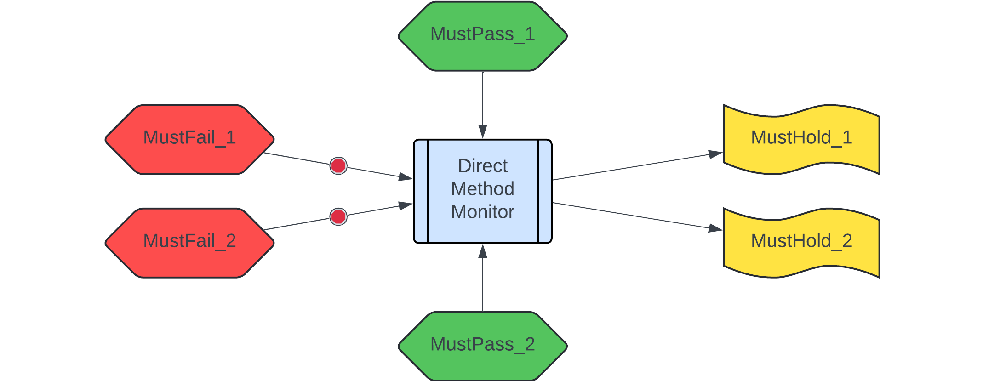
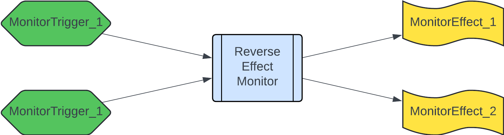

# Direct and Reverse Monitor Specifications

_Andrey Kuprianov, 2024_

------

Runtime monitoring, also known as [Runtime verification][], is a well-established field, where many practical approaches have been devised and applied successfully. Based on this heritage, we propose a Web-3 runtime monitoring system for the Stellar blockchain, which is based on the [TLA+][] specification language, a well-established formalism for specifying and verifying distributed systems. 

What do we want to achieve with runtime monitors? Eventually, runtime monitors are going to be deployed on the live blockchain, and they should satisfy three requirements:

- **Prevent safety violations** (_safety_): bad things, such as your token balance being stolen, should not happen. This is the primary goal of runtime monitors: react preventively, and abort unwanted executions.
- **Detect liveness violations** (_liveness_): good things should be able to happen! E.g. you, as an account owner, should be able to withdraw your own balance. If a legitimate transaction keeps reverting, that's also a bug, not less severe than someone stealing your tokens.
- **Detect unexpected behaviors** (_completeness_): same as code, specs are not perfect. If a spec author overlooked some behaviors, and they manifest themselves on the live blockchain, this may mean anything: from simple spec incompleteness, to an exploit being executed. Monitors can be configured to either issue a simple warning, or to prevent such behaviors altogether.

The problem we've observed with the specification approaches previously is that the specs of _what_ the method should do can easily be much larger than the actual implementation; compare e.g. this [ERC-721 Certora spec][] with the [ERC-721 implementation][] (don't forget to exclude comments when comparing).

So monitors should be able to specify both safety and liveness properties, do it _compactly_, and at the same time be _complete_ wrt. the current and future system behaviors. For that we impose a certain structure to the direct reasoning (cause -> effect), as well as complement it with reverse reasoning (effect -> cause).


## Direct monitor specs

Here we reason from the cause (method invocation) to the effect, but apply a structure which closely mimics in formal semantics what we expect to see when we program smart contracts. The essence of the structure is in the picture below:



- `MustFail_i` is a condition under which the method is expected to fail. If _any_ of those conditions hold, the monitor fires, and checks that the method does indeed fail;
- `MustPass_i` is a condition, under which the method is expected to succeed, _provided that_ none of the `MustFail_i` conditions fired. Each `MustPass_i` condition represents a separate happy path in the method invocation;
- `MustHold_i` is a condition that should hold over past and next state variables, if the method invocation is successful (e.g. the tokens should be transferred). _All_ of `MustHold_i` should hold if the method is executed successfully.


In the above, `Must<Fail|Pass|Hold>` is a prefix, which tells the monitor system how to interpret this predicate. The complete pattern for predicate names with these prefixes is as follows:

```
Must<Fail|Pass|Hold>_<Method>_<ConditionDescription>
```

All predicates which refer to the same `<Method>` will be grouped, to create together one _method monitor_. Interpreted formally, the monitor should do the following when `<Method>` is invoked:

1. If any of `MustFail_i` conditions fire, check that method invocation reverts (otherwise, issue a warning / revert if configured to do so)
2. If none of `MustFail_i` conditions fired, but method invocation reverted, issue a warning (incomplete spec)
3. If none of  `MustFail_i` fired, and one of `MustPass_i` conditions fired, check that method invocation succeeds (otherwise, issue a warning)
3. If none of  `MustFail_i` fired, and none of `MustPass_i` conditions fired, but method invocation succeeded, issue a warning of an incomplete spec (or revert if configured to do so)
4. If method invocation succeeds, check that all of `MustHold_i` conditions hold on the pre- and post-states of the method invocation (otherwise, issue a warning / revert if configured to do so)


Notice that above we apply _or_ as default connector for preconditions (`MustFail_i` / `MustPass_i`), and we apply _and_ as default connector for effects (`MustHold_i`). Thus, you may split preconditions/effects into separate predicates at your convenience, thus avoiding complicated logical structure inside predicates themselves.

Now, is the approach described above enough to achieve the goals (safety, liveness, completeness) stated above? Think about it for a sec, before clicking on the our answer below.

<details>
<summary> Are direct monitor specs enough?</summary>
You may have guessed the answer: we believe NO! And here is an (incomplete) list of whys:

1. A method may have a side effect, which was overlooked by the spec author. E.g. a boolean flag is set, which in another method allows to direct funds to another account.
2. Code evolves, but the spec stays as is; as a result a side effect above is introduced unintentionally, with the stale spec not accounting for it.
3. Internal state component is modified in multiple methods, in different ways. The specification about how the component should be updated is scattered in multiple places, and loopholes may easily creep in.
4. An invariant which is preserved by the method of this contract, is violated by a method from another contract. As no specs are written or monitored for this other contract, no violation is detected.

Thus we proceed to explore _reverse reasoning_.
</details>


## Reverse monitor specs

With reverse reasoning we will try to patch the loopholes that were left by direct monitor specs above. To do so, we start with an _effect_ (state was modified), and go back to its _cause_ (what should have happened taking the effect into account). Here is the corresponding picture which puts a bit of structure into the reverse reasoning.




- `MonitorTrigger_i` is a condition which triggers (activates) the monitor. If _any_ of those conditions hold, the monitor is activated;
- `MonitorEffect_i` is a condition over past and next state variables, which specifies the effect that the the monitor, if activated, should check. _All_ of `MonitorEffect_i` should hold if the transaction is successful.

Similar to direct reasoning, in the above, `Monitor<Trigger|Effect>` is a prefix, which tells the monitor system how to interpret this predicate. The complete pattern for predicate names with these prefixes is as follows:

```
Monitor<Trigger|Effect>_<Monitor>_<ConditionDescription>
```

All predicates which refer to the same `<Monitor>` will be grouped, to create together one _effect monitor_. Interpreted formally, the monitor should do the following when activated is invoked:

- If _any_ of `MonitorTrigger_i` conditions fire, check that _all_ `MonitorEffect_i` hold over the past and next states (otherwise, issue a warning / revert if configured to do so)

Again, imposing a simple structure which combines triggers with _or_, but effects with _and_ allows you to avoid cumbersome logic inside monitor predicates.

Let's take a look at how reverse monitor specs help us to patch the loopholes described above:

1. Overlooked side effects: a reverse monitor will detect _all_ changes to the monitored state, no matter where they originate.
2. Side effects introduced during system evolution: same as above. Additionally, if an effect monitor is configured to revert in case of unexpected effects taking place, the developers will be forced to keep the spec in sync with the implementation.
3. Inconsistent / spread-out specs: An effect monitor may describe all effects that may happen wrt. a particular state component in one place. As this monitor will be triggered when any of the methods that modify the state is executed, this also brings us considerable savings in terms of spec size/complexity, as similar effects can be grouped together.
4. Unrestricted access from other contracts/methods: as in 1. and 2., it doesn't matter again where the modification comes from: if the state component we monitor is being changed, the monitor will detect it.


## Verifying monitor specifications

All that is nice and good, but there are a few questions that still need to be addressed, as people with different backgrounds might feel:

- Formal Methods: "How do you _verify_ monitor specs?"
- Math: "What about verification _complexity_?"
- Software engineering: "How do you _practically check_ them on the blockchain?"

This section outlines the answers to the above questions. TL;DR; for those who are not interested in these details:

- We verify monitor specs via a) producing verification conditions from each monitor specification; b) extracting transactions from the blockchain; c) validating each transaction against verification conditions using the Apalache model checker.
- Complexity of verifying monitor specs is _linear_ wrt. the number of conditions in the specification, and the number of transactions: each condition is checked _at most once_ against every transaction (but many checks may be skipped/optimized away).
- Practically, we integrate monitor specs as outlined here in the `solarcraft verify` command; the documentation for which can be found elsewhere in this repo. `Solarcraft` is a tool that we write specifically for checking monitor specifications against blockchain transactions. Currently we are doing it in _offline mode_ by first downloading transactions using `solarcraft fetch`, and then verifying them; eventually we want to move into verifying monitor specs on the live blockchain, i.e. we want to do _online monitoring_.

If you are still interested in the details -- continue reading!


### Checking monitor verification conditions

Formally, a blockchain is a sequence of _ledgers_, where each ledger is a snapshot of the blockchain _state_. States are partitioned, into separate spaces per contract, and then into separate regions per contract variable. 

Blockchain states are mutated by _transactions_, where each transaction is an invocation of a certain contract _method_ with the corresponding method parameters supplied. The invoked method modifies the states according to its logic.

For our purposes we consider only the state as it's relevant for a single contract and its variables. Thus we will use the following notations:

- $D$ is a set of all possible data values: strings, numbers, structs, etc. Mathematically we don't distinguish between different data types (though practically we of course do).
- $V$ is a set of typed contract variables.
- $S = S_0, S_1, ...$ is a sequence of states.
- $S_i \subseteq V \rightarrow D$ is the $i$-th contract state, which is a partial mapping from variables to their data values. If a variable $v$ is present in the mapping $S_i$, we say that it _exists_ in this state.
- $T = T_0, T_1, ...$ is a sequence of transactions. Each transaction brings the contract into its next state, which we denote by $S_i \xrightarrow{T_i} S_{i+1}$.
- $P$ is a set of all possible method parameter names. We reserve "method" to denote the name of the invoked contract method.
- $T_i \subseteq P \rightarrow D$ is a partial mapping from parameter names to their values; only the parameters specific to the method invoked are present in the mapping.

### Monitor verification complexity

TODO

### Practical checking of monitor specifications

TODO


[Runtime verification]: https://en.wikipedia.org/wiki/Runtime_verification
[TLA+]: https://en.wikipedia.org/wiki/TLA%2B
[Timelock contract]: https://github.com/stellar/soroban-examples/blob/v20.0.0/timelock/src/lib.rs
[SCF 24 submission example]: ./scf24/example/README.md
[ERC-721 Certora spec]: https://github.com/OpenZeppelin/openzeppelin-contracts/blob/255e27e6d22934ddaf00c7f279039142d725382d/certora/specs/ERC721.spec
[ERC-721 implementation]: https://github.com/OpenZeppelin/openzeppelin-contracts/blob/255e27e6d22934ddaf00c7f279039142d725382d/contracts/token/ERC721/ERC721.sol
[Timelock monitor spec]: ./case-studies/timelock/timelock_monitor.tla